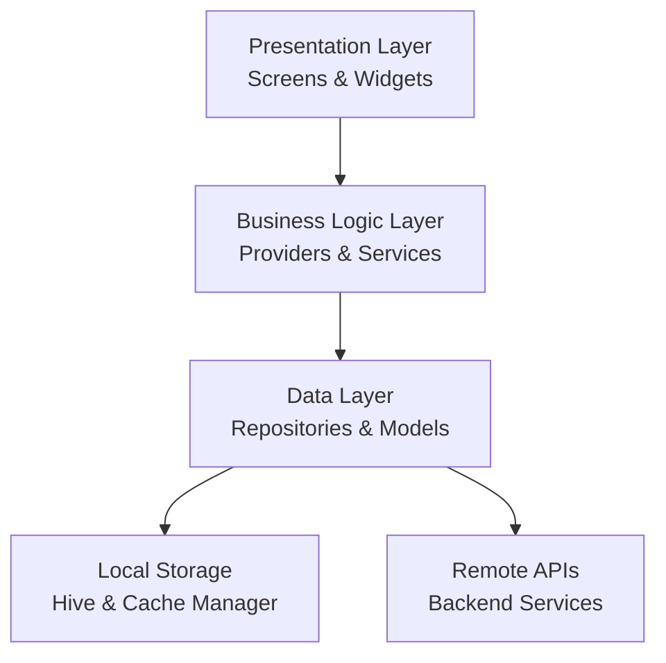

# Design Document

## Overview

AccentAura is a Flutter-based mobile application that provides an immersive language learning experience with AI-powered features. The architecture follows clean architecture principles with clear separation between presentation, business logic, and data layers. The app uses Riverpod for state management, go_router for navigation, and implements offline-first patterns with local caching via Hive.

### Key Design Principles

- **Offline-first**: All content is cached locally; sync happens in background with automatic retry logic
- **Modular architecture**: Clear separation of concerns with feature-based organization
- **Performance-optimized**: Lazy loading, image caching, memory-efficient media handling, compressed media
- **Testable**: Dependency injection via Riverpod providers enables comprehensive testing
- **Scalable**: Backend-ready with well-defined API contracts
- **Secure**: HTTPS for all communications, encrypted token storage, no sensitive data logging
- **Progressive unlock**: Lessons unlock sequentially based on completion to maintain learning flow

## Architecture

### High-Level Architecture



### Layer Responsibilities

**Presentation Layer**
- Screens: Full-page views (Splash, Auth, Home, LessonTree, LessonPlayer, AIChat, Interview, Profile)
- Widgets: Reusable UI components (LevelCard, ActivityWidgets, ProgressWidgets)
- Consumes providers for state and business logic
- No direct service or repository access

**Business Logic Layer**
- Providers: Riverpod providers managing state and exposing business operations
- Services: Specialized services for audio, TTS, WebRTC, AI interactions
- Orchestrates data flow between presentation and data layers
- Handles business rules (unlock logic, XP calculation, streak management)

**Data Layer**
- Repositories: Abstract data access (LessonRepository, UserRepository, ProgressRepository)
- Models: Data classes with JSON serialization (Lesson, Activity, UserProgress)
- API Service: HTTP client wrapper using Dio
- Cache Service: Local storage management using Hive and flutter_cache_manager

## Components and Interfaces

### Design Rationale for Core Architecture

**Offline-First Approach**: The decision to implement offline-first architecture addresses Requirement 8, ensuring users can continue learning without interruption. This is achieved through aggressive caching of lesson content and queueing of progress updates, with automatic synchronization when connectivity is restored.

**Sequential Lesson Unlocking**: To maintain a structured learning path (Requirement 3), lessons unlock only after completing the previous level. This prevents users from skipping ahead and ensures proper skill progression.

**Real-Time Progress Updates**: The use of StreamProvider for user progress (Requirement 2) ensures the dashboard reflects changes immediately, providing instant feedback and maintaining user engagement.

**Gamification Integration**: XP, badges, and streaks (Requirement 7) are deeply integrated into the progress tracking system, with calculations happening at the repository level to ensure consistency across offline and online states.

**Security-First Design**: All authentication tokens are stored using flutter_secure_storage (Requirement 9), and all API communications use HTTPS with certificate pinning in production to protect user data.

**Social Authentication Integration**: OAuth 2.0 flow is implemented for Google and Facebook login (Requirement 1), using platform-specific SDKs (google_sign_in, flutter_facebook_auth) to obtain tokens that are exchanged with the backend for app-specific JWT tokens.

**Analytics-Driven Insights**: Firebase Analytics integration (Requirement 9) tracks all user interactions, lesson completions, and performance metrics to provide insights for improving the learning experience and identifying areas where users struggle.

### Core Services

#### API Service
```dart
class ApiService {
  final Dio _dio;
  
  // Authentication endpoints
  Future<AuthResponse> loginWithCredentials(String email, String password);
  Future<AuthResponse> loginWithOAuth(String provider, String token);
  Future<TokenResponse> refreshAuthToken(String refreshToken);
  Future<bool> validateToken(String token);
  
  // Lesson endpoints
  Future<List<Lesson>> getLevels(int from, int to);
  Future<Lesson> getLevel(int level);
  
  // Progress endpoints
  Future<void> saveProgress(ProgressUpdate update);
  Future<UserProgress> getUserProgress(String userId);
  
  // AI endpoints
  Future<AIChatResponse> sendChatMessage(String prompt);
  Future<SpeechAnalysis> analyzeSpeech(File audioFile);
  Future<InterviewSession> startInterview();
  Future<InterviewResult> submitInterview(File audioFile, File videoFile);
  
  // Leaderboard endpoints
  Future<LeaderboardData> getLeaderboard({int limit = 100});
  Future<UserRank> getUserRank(String userId);
}
```

#### Cache Service
```dart
class CacheService {
  final Box<dynamic> _box; // Hive box
  final DefaultCacheManager _cacheManager;
  
  Future<void> cacheLessonData(Lesson lesson);
  Future<Lesson?> getCachedLesson(int level);
  Future<void> cacheMediaFile(String url);
  Future<File?> getCachedMedia(String url);
  Future<void> queueProgressUpdate(ProgressUpdate update);
  Future<List<ProgressUpdate>> getPendingUpdates();
  Future<void> clearPendingUpdate(String id);
}
```

#### Audio Service
```dart
class AudioService {
  final FlutterSoundRecorder _recorder;
  final AudioPlayer _player;
  
  Future<void> startRecording();
  Future<File> stopRecording();
  Future<void> playAudio(String url);
  Future<void> stopAudio();
  Stream<RecordingStatus> get recordingStream;
}
```

#### TTS Service
```dart
class TtsService {
  final FlutterTts _tts;
  
  Future<void> speak(String text, {String? language});
  Future<void> stop();
  Future<void> setVoice(String voice);
  Stream<TtsState> get stateStream;
}
```

#### WebRTC Service
```dart
class WebRtcService {
  RTCVideoRenderer? _localRenderer;
  
  Future<void> initializeCamera();
  Future<void> startRecording();
  Future<File> stopRecording();
  RTCVideoRenderer get localRenderer;
  Future<void> dispose();
}
```

#### Analytics Service
```dart
class AnalyticsService {
  final FirebaseAnalytics _analytics;
  
  Future<void> logEvent(String name, Map<String, dynamic>? parameters);
  Future<void> logLogin(String method);
  Future<void> logLessonStarted(int level);
  Future<void> logLessonCompleted(int level, int xpEarned, Duration timeTaken);
  Future<void> logActivityCompleted(String activityType, double score);
  Future<void> logXpEarned(int amount, String source);
  Future<void> logStreakIncremented(int newStreak);
  Future<void> logBadgeAwarded(String badgeId);
  Future<void> logInterviewCompleted(double confidenceScore, double grammarScore);
  Future<void> setUserId(String userId);
  Future<void> setUserProperty(String name, String value);
}
```

### Repositories

#### User Repository
```dart
class UserRepository {
  final ApiService _apiService;
  final CacheService _cacheService;
  final FlutterSecureStorage _secureStorage;
  
  Future<AuthResult> loginWithEmail(String email, String password);
  Future<AuthResult> loginWithGoogle();
  Future<AuthResult> loginWithFacebook();
  Future<void> logout();
  Future<String?> getCachedToken();
  Future<void> saveToken(String token);
  Future<void> clearToken();
  Future<bool> validateToken(String token);
  Future<String> refreshToken(String token);
}
```

#### Lesson Repository
```dart
class LessonRepository {
  final ApiService _apiService;
  final CacheService _cacheService;
  
  Future<List<Lesson>> getLessons(int from, int to, {bool forceRefresh = false});
  Future<Lesson> getLesson(int level, {bool forceRefresh = false});
  Stream<List<Lesson>> watchLessons();
}
```

#### Progress Repository
```dart
class ProgressRepository {
  final ApiService _apiService;
  final CacheService _cacheService;
  
  Future<UserProgress> getUserProgress(String userId);
  Future<void> updateProgress(ProgressUpdate update);
  Future<void> awardXp(String userId, int xp, {String? source});
  Future<void> updateStreak(String userId);
  Future<void> resetStreak(String userId);
  Future<void> awardBadge(String userId, String badgeId);
  Future<void> syncPendingUpdates();
  Stream<UserProgress> watchProgress(String userId);
}
```

### State Management with Riverpod

#### Key Providers

```dart
// Auth state
final authProvider = StateNotifierProvider<AuthNotifier, AuthState>((ref) {
  return AuthNotifier(ref.read(apiServiceProvider));
});

// User progress with real-time updates
final userProgressProvider = StreamProvider<UserProgress>((ref) {
  final userId = ref.watch(authProvider).userId;
  return ref.read(progressRepositoryProvider).watchProgress(userId);
});

// Lessons with offline support
final lessonsProvider = FutureProvider.family<List<Lesson>, LessonRange>((ref, range) {
  return ref.read(lessonRepositoryProvider).getLessons(range.from, range.to);
});

// Current lesson
final currentLessonProvider = StateProvider<Lesson?>((ref) => null);

// Activity state with XP calculation
final activityStateProvider = StateNotifierProvider.family<ActivityNotifier, ActivityState, String>(
  (ref, activityId) => ActivityNotifier(activityId, ref.read(progressRepositoryProvider))
);

// Connectivity state
final connectivityProvider = StreamProvider<ConnectivityResult>((ref) {
  return Connectivity().onConnectivityChanged;
});

// Streak management
final streakProvider = Provider<StreakService>((ref) {
  return StreakService(ref.read(progressRepositoryProvider));
});

// Leaderboard data
final leaderboardProvider = FutureProvider<LeaderboardData>((ref) {
  return ref.read(apiServiceProvider).getLeaderboard();
});

// User rank
final userRankProvider = FutureProvider<UserRank>((ref) {
  final userId = ref.watch(authProvider).userId;
  return ref.read(apiServiceProvider).getUserRank(userId);
});

// Analytics service
final analyticsProvider = Provider<AnalyticsService>((ref) {
  return AnalyticsService(FirebaseAnalytics.instance);
});
```

## Data Models

### Lesson Model
```dart
class Lesson {
  final int level;
  final String title;
  final int xpReward;
  final List<Activity> activities;
  final bool isLocked;
  final bool isCompleted;
  
  factory Lesson.fromJson(Map<String, dynamic> json);
  Map<String, dynamic> toJson();
}
```

### Activity Model
```dart
abstract class Activity {
  final String id;
  final ActivityType type;
  
  factory Activity.fromJson(Map<String, dynamic> json) {
    switch (json['type']) {
      case 'flashcard': return FlashcardActivity.fromJson(json);
      case 'mcq': return McqActivity.fromJson(json);
      case 'fill_blank': return FillBlankActivity.fromJson(json);
      case 'listening': return ListeningActivity.fromJson(json);
      case 'speaking': return SpeakingActivity.fromJson(json);
      default: throw UnimplementedError();
    }
  }
}

class FlashcardActivity extends Activity {
  final List<FlashcardItem> items;
}

class McqActivity extends Activity {
  final String question;
  final List<String> options;
  final String correctAnswer;
}

class SpeakingActivity extends Activity {
  final String prompt;
  final String? expectedResponse;
}
```

### User Progress Model
```dart
class UserProgress {
  final String userId;
  final int currentLevel;
  final int totalXp;
  final int streak;
  final DateTime? lastActivityDate; // Track for streak calculation
  final int coins;
  final List<Badge> badges;
  final Map<int, LessonProgress> lessonProgress;
  
  factory UserProgress.fromJson(Map<String, dynamic> json);
  Map<String, dynamic> toJson();
  
  // Business logic for streak management
  bool shouldResetStreak(DateTime currentDate);
  bool shouldIncrementStreak(DateTime currentDate);
}

class LessonProgress {
  final int level;
  final bool completed;
  final int xpEarned;
  final Map<String, ActivityResult> activityResults;
}

class Badge {
  final String id;
  final String name;
  final String description;
  final String iconUrl;
  final DateTime earnedAt;
  
  factory Badge.fromJson(Map<String, dynamic> json);
  Map<String, dynamic> toJson();
}
```

### Authentication Models
```dart
class AuthResult {
  final String token;
  final String refreshToken;
  final User user;
  final UserProgress progress;
  
  factory AuthResult.fromJson(Map<String, dynamic> json);
}

class User {
  final String id;
  final String email;
  final String? name;
  final String? avatarUrl;
  final AuthProvider provider; // email, google, facebook
  
  factory User.fromJson(Map<String, dynamic> json);
  Map<String, dynamic> toJson();
}

enum AuthProvider { email, google, facebook }
```

### Leaderboard Models
```dart
class LeaderboardData {
  final List<LeaderboardEntry> entries;
  final DateTime lastUpdated;
  
  factory LeaderboardData.fromJson(Map<String, dynamic> json);
}

class LeaderboardEntry {
  final String userId;
  final String username;
  final String? avatarUrl;
  final int totalXp;
  final int rank;
  final int streak;
  
  factory LeaderboardEntry.fromJson(Map<String, dynamic> json);
}

class UserRank {
  final int rank;
  final int totalUsers;
  final int percentile;
  
  factory UserRank.fromJson(Map<String, dynamic> json);
}
```

## Navigation Structure

### Route Configuration with go_router

```dart
final routerProvider = Provider<GoRouter>((ref) {
  final authState = ref.watch(authProvider);
  
  return GoRouter(
    initialLocation: '/splash',
    redirect: (context, state) {
      final isAuthenticated = authState.isAuthenticated;
      final isOnAuthPage = state.location == '/auth';
      
      if (!isAuthenticated && !isOnAuthPage) return '/auth';
      if (isAuthenticated && isOnAuthPage) return '/home';
      return null;
    },
    routes: [
      GoRoute(path: '/splash', builder: (context, state) => SplashScreen()),
      GoRoute(path: '/auth', builder: (context, state) => AuthScreen()),
      GoRoute(
        path: '/home',
        builder: (context, state) => HomeScreen(),
        routes: [
          GoRoute(path: 'lesson-tree', builder: (context, state) => LessonTreeScreen()),
          GoRoute(path: 'lesson/:level', builder: (context, state) {
            final level = int.parse(state.params['level']!);
            return LessonPlayerScreen(level: level);
          }),
          GoRoute(path: 'ai-practice', builder: (context, state) => AIPracticeScreen()),
          GoRoute(path: 'interview', builder: (context, state) => InterviewScreen()),
          GoRoute(path: 'leaderboard', builder: (context, state) => LeaderboardScreen()),
          GoRoute(path: 'profile', builder: (context, state) => ProfileScreen()),
        ],
      ),
    ],
  );
});
```

## Screen Designs

### Splash Screen
- Display app logo with loading animation
- Check for cached auth token using flutter_secure_storage
- Validate token and fetch user progress from backend if token exists
- Fetch remote config if needed
- Navigate to Auth screen if no valid token exists
- Navigate to Home dashboard if authentication succeeds
- Handle token expiration and refresh logic

### Auth Screen
- Email/password input fields with validation (email format, password minimum length)
- Social login buttons (Google via OAuth 2.0, Facebook via OAuth 2.0)
- "Forgot Password" and "Sign Up" links
- Error handling with user-friendly messages and retry option
- Loading state during authentication with spinner
- On successful authentication, stores JWT token securely using flutter_secure_storage
- Fetches user progress from backend after authentication
- Navigates to home dashboard after successful authentication
- OAuth flow: Opens platform-specific login → receives OAuth token → exchanges with backend for JWT → stores JWT securely

### Home Dashboard
- Top section: Avatar, XP bar, streak flame icon, coin count
- Quick action cards: "Continue Last Level", "AI Practice", "Interview Mode", "Leaderboard", "Profile"
- Bottom navigation: Home, Lesson Tree, Leaderboard, Profile
- Pull-to-refresh for syncing latest progress
- Real-time progress updates reflected immediately when data changes
- Offline indicator displayed when network is unavailable

### Lesson Tree Screen
- Scrollable grid/tree layout with 100 lesson nodes
- Each node shows: level number, title, XP reward, lock/unlock icon, completion checkmark
- Visual path connecting completed lessons
- Locked lessons are grayed out with lock icon and cannot be tapped
- Unlocked lessons are interactive and navigate to Lesson Player on tap
- Progress indicator at top showing overall completion
- Loads lesson metadata from local cache when offline
- Completed lessons automatically unlock the next level in sequence

### Lesson Player Screen
- Top bar: lesson title, progress indicator (e.g., "3/5 activities")
- Activity area: dynamically renders based on activity type
- Bottom buttons: "Skip" (if allowed), "Check Answer", "Continue"
- Flashcard: swipeable card with image, word, audio play button (plays on tap)
- MCQ: question text, radio buttons for options, submit button with answer validation
- Fill Blank: sentence with blank, text input field with validation feedback
- Listening: audio player, question, answer options with submission
- Speaking: prompt text, record button (hold to record), waveform visualization, sends audio to backend for scoring, displays score and feedback
- Completion screen: XP earned animation based on performance, progress update, "Next Lesson" button
- Loads all activities from backend or cache at lesson start
- Queues progress updates locally when offline for later synchronization

### AI Practice Screen
- Chat interface with message bubbles (user vs AI)
- Text input field at bottom with send button
- Microphone button for voice input using speech_to_text
- Animated AI avatar (Rive/Lottie) that animates when speaking
- Audio playback for AI responses using TTS
- Scroll to latest message automatically
- Sends text messages to backend AI service and displays responses
- Records audio, transcribes using speech_to_text, sends transcription to backend
- Displays offline message and disables voice features when backend is unreachable

### Interview Screen
- Camera preview showing user (front camera)
- Animated AI interviewer in corner or overlay that asks questions
- Question text displayed at top
- Record button to capture audio/video response simultaneously
- Timer showing remaining time for response
- Submit button to send audio/video to backend for analysis
- Results screen: confidence score gauge, grammar score, actionable feedback text, performance charts using fl_chart
- Permission request dialog with explanation if camera or microphone permissions are denied
- Provides option to open app settings if permissions are permanently denied

### Profile Screen
- User avatar and name
- XP progress bar with current level and total XP
- Streak counter with calendar view showing consecutive days
- Badge showcase grid displaying all earned badges with achievement notifications
- Current level display with progress to next level
- Settings button
- Logout button

### Leaderboard Screen
- Top 100 users ranked by total XP
- Each entry shows: rank, username, avatar, total XP, current streak
- User's own rank highlighted and pinned at top if not in top 100
- Pull-to-refresh to update leaderboard data
- Percentile indicator showing user's position relative to all users
- Loads from cache when offline with "Last updated" timestamp
- Smooth scroll to user's position with "Find Me" button

## Error Handling

### Network Errors
- Detect offline state using connectivity_plus
- Display snackbar: "You're offline. Using cached content."
- Queue all progress updates in local storage for later sync
- Automatically sync queued updates when connectivity is restored
- Retry failed requests with exponential backoff (1s, 2s, 4s, 8s, max 30s)
- If sync fails, keep updates in queue for next retry attempt

### Permission Errors
- Request permissions using permission_handler before accessing camera/microphone
- If denied, show dialog explaining why permission is needed
- Provide button to open app settings

### API Errors
- 401 Unauthorized: Clear token, navigate to auth screen
- 404 Not Found: Show "Content not available" message
- 500 Server Error: Show "Something went wrong. Please try again."
- Timeout: Show "Request timed out. Check your connection."

### Media Errors
- Audio recording fails: Show "Microphone not available"
- Audio playback fails: Show "Unable to play audio"
- Video recording fails: Show "Camera not available"
- Cache miss: Fetch from network, show loading indicator

## Testing Strategy

### Unit Tests
- **Models**: Test JSON serialization/deserialization, validation logic
- **Services**: Mock Dio/Hive, test API calls, caching logic, audio recording/playback
- **Repositories**: Mock services, test data fetching, caching, sync logic
- **Providers**: Test state transitions, business logic (XP calculation, unlock logic)

### Widget Tests
- **LevelCard**: Test locked/unlocked states, tap behavior
- **ActivityWidgets**: Test rendering for each activity type, user interactions
- **ProgressWidgets**: Test XP bar, streak counter, badge display
- **Screens**: Test basic rendering, navigation, error states

### Integration Tests
- **Auth Flow**: Launch app → login → verify home screen
- **Lesson Flow**: Navigate to lesson tree → tap lesson → complete activities → verify XP update
- **Speaking Flow**: Start speaking activity → record audio → submit → verify feedback
- **Offline Flow**: Disable network → complete lesson → enable network → verify sync

### Performance Tests
- Memory profiling during lesson playback
- Frame rate monitoring during animations
- Network bandwidth usage during media loading
- Battery consumption during extended use

## Offline Capability Implementation

### Caching Strategy

**Lesson Data**
- Cache lesson JSON in Hive on first fetch
- Cache images using cached_network_image with custom cache manager
- Cache audio files using flutter_cache_manager
- Preload next 3 lessons when user completes current lesson

**Progress Data**
- Store all progress updates in Hive queue
- Sync queue when connectivity is restored
- Merge server response with local state
- Handle conflicts (server wins for completed lessons)

**Media Preloading**
- Download lesson media on WiFi only (configurable)
- Show download progress in lesson tree
- Allow manual download of specific lessons

### Sync Logic

```dart
class SyncService {
  final CacheService _cacheService;
  final ApiService _apiService;
  final Connectivity _connectivity;
  
  Future<void> syncPendingUpdates() async {
    if (!await _connectivity.hasConnection()) return;
    
    final pending = await _cacheService.getPendingUpdates();
    for (final update in pending) {
      try {
        await _apiService.saveProgress(update);
        await _cacheService.clearPendingUpdate(update.id);
      } catch (e) {
        // Keep in queue, will retry later with exponential backoff
        break;
      }
    }
  }
  
  void startPeriodicSync() {
    Timer.periodic(Duration(minutes: 5), (_) => syncPendingUpdates());
  }
  
  // Automatically triggered when connectivity is restored
  void onConnectivityRestored() {
    syncPendingUpdates();
  }
}
```

## Security Considerations

### Authentication
- Store JWT tokens in flutter_secure_storage (encrypted)
- Implement token refresh logic before expiration
- Clear tokens on logout
- Use HTTPS for all API communication

### Data Protection
- Encrypt sensitive user data in Hive
- Sanitize user inputs before sending to backend
- Validate all API responses before processing
- Implement certificate pinning for production

### Privacy
- Request minimal permissions
- Explain permission usage to users
- Don't log sensitive information (tokens, passwords)
- Implement GDPR-compliant data deletion

## Performance Optimizations

### Memory Management
- Dispose audio players when not in use
- Release camera resources when leaving interview screen
- Limit cached images to 100MB
- Use const constructors for static widgets

### Network Optimization
- Compress images before upload
- Use WebP format for images
- Implement pagination for lesson list (load 20 at a time)
- Debounce AI chat requests (500ms)

### UI Performance
- Use ListView.builder for long lists
- Implement hero animations for smooth transitions
- Lazy load lesson tree nodes (render visible + 10 above/below)
- Use RepaintBoundary for complex widgets

## Analytics and Monitoring

### Events to Track
- User registration/login (authentication method)
- Lesson started/completed (level number, time taken)
- Activity completed (by type, performance score)
- XP earned (source, amount)
- Streak incremented/reset
- Badge awarded (badge ID, milestone)
- AI practice session duration
- Interview completed (confidence score, grammar score)
- App crashes and errors
- Network request failures
- Offline mode usage
- Sync success/failure events

### Crash Reporting
- Initialize Sentry/Firebase Crashlytics in main()
- Capture unhandled exceptions
- Log breadcrumbs for debugging
- Attach user context (non-PII only)
- Never log sensitive data (tokens, passwords, personal information)
- Track error rates and performance metrics

### Analytics Implementation
- Initialize Firebase Analytics in main() before runApp()
- Log all events defined in Analytics Service
- Track screen views automatically using NavigatorObserver
- Set user ID after successful authentication
- Set user properties: current level, total XP, streak
- Track custom events with parameters for detailed analysis
- Respect user privacy settings and provide opt-out option
- Use DebugView in development to verify event tracking

## Accessibility

### Screen Reader Support
- Add semantic labels to all interactive elements
- Provide text alternatives for images
- Announce state changes (XP earned, level unlocked)

### Visual Accessibility
- Support system font scaling
- Maintain 4.5:1 contrast ratio for text
- Provide visual feedback for all interactions
- Support dark mode

### Input Accessibility
- Ensure tap targets are at least 44x44 points
- Support keyboard navigation where applicable
- Provide alternative input methods (text for voice)

## Deployment Considerations

### Build Variants
- Development: Debug mode, mock backend, verbose logging
- Staging: Release mode, staging backend, error logging only
- Production: Release mode, production backend, crash reporting

### App Store Requirements
- iOS: Handle background audio, request permissions with usage descriptions
- Android: Declare permissions in manifest, handle runtime permissions
- Both: Provide privacy policy, implement in-app purchases (if applicable)

### CI/CD Pipeline
- Run tests on every commit
- Build and deploy to TestFlight/Play Console on merge to main
- Automated screenshot generation for store listings
- Version bumping and changelog generation
